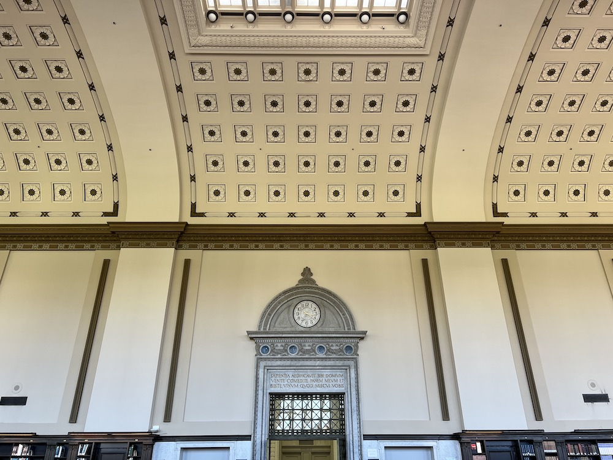
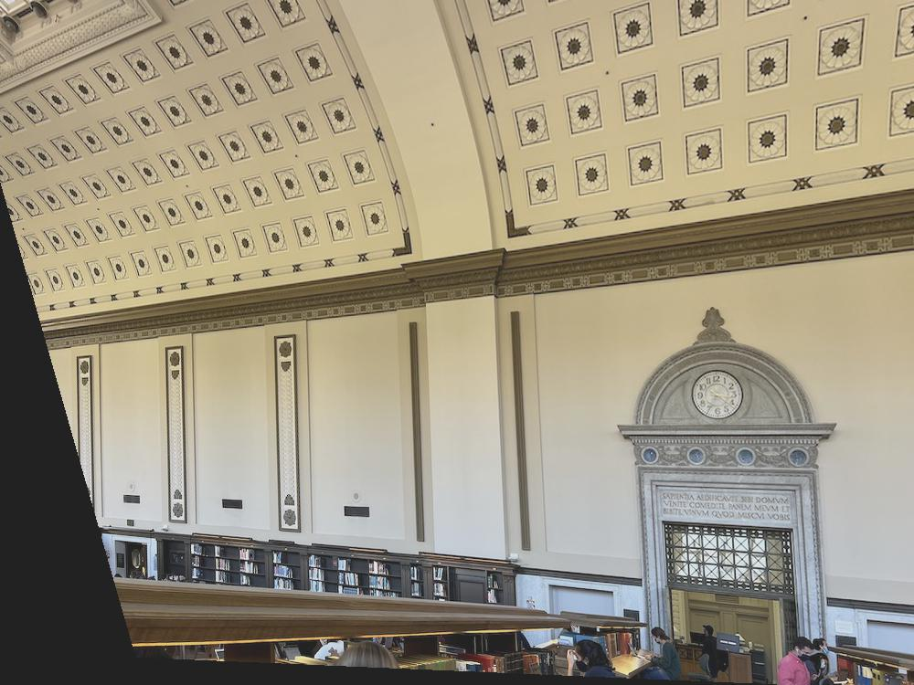
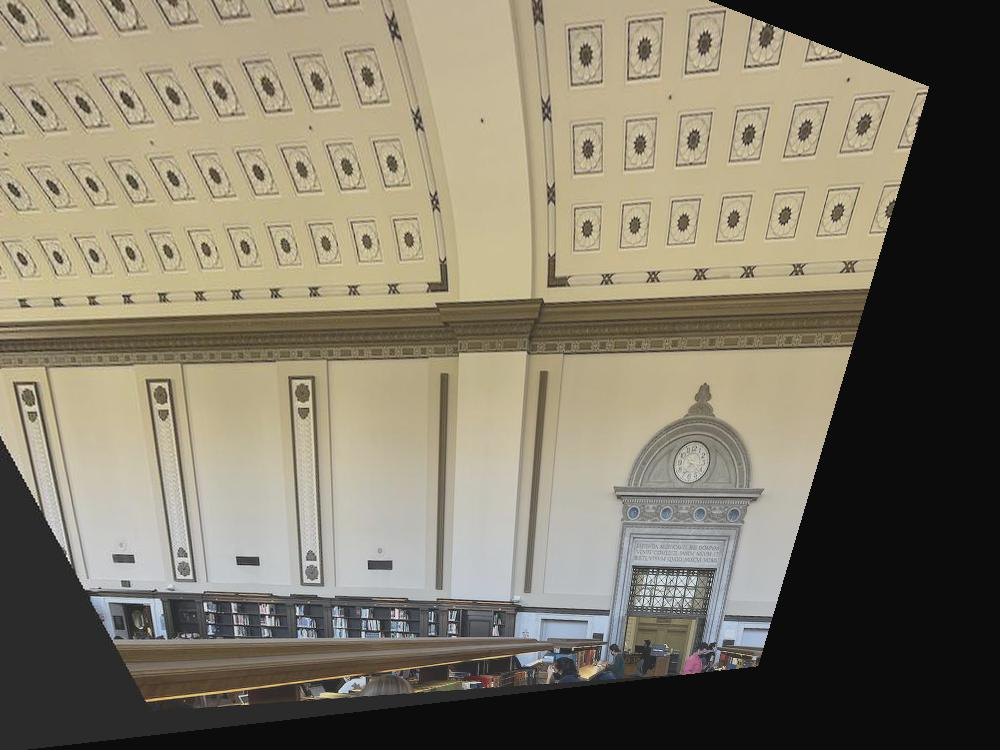
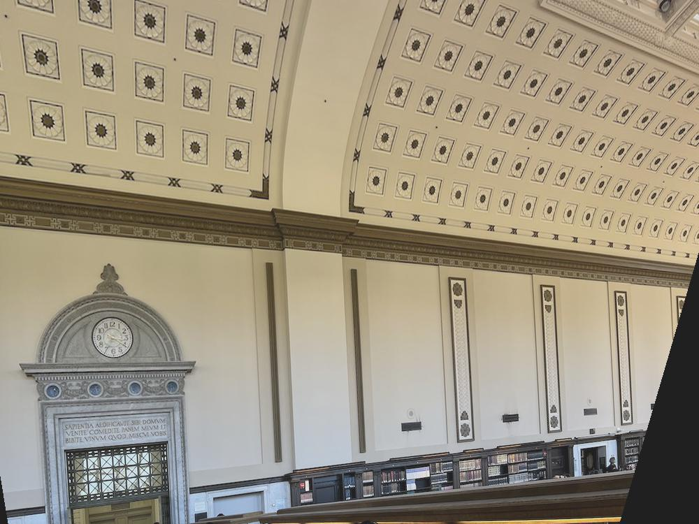
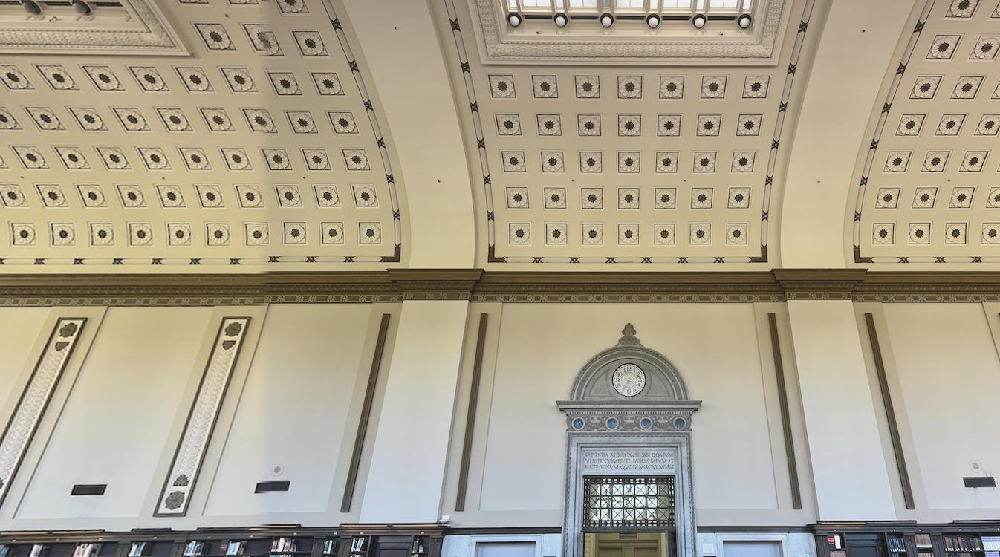
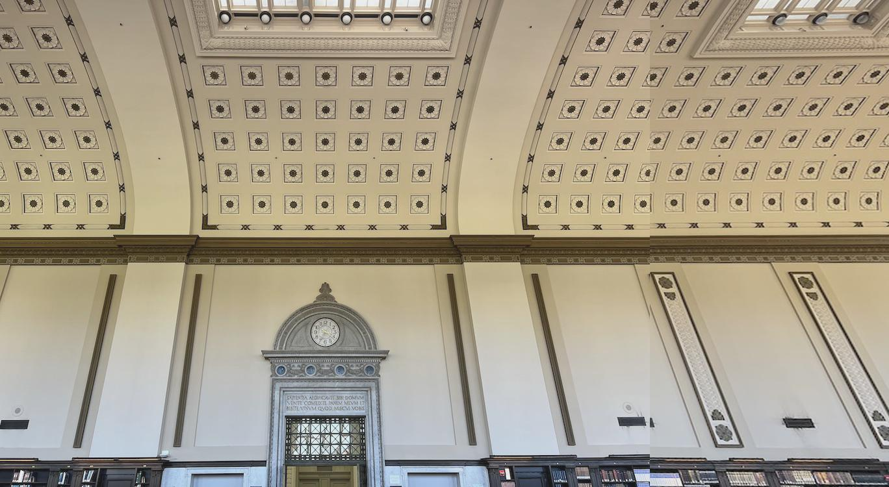

## Image Warping and Mosaicing

### Introduction

Images can be viewed as rays of light that pass through the same center projecting onto a plane. The "center" mentioned above is called *the center of projection*. Whether it's projecting through a pinhole camera or taking pictures with digital single lens reflex camera, the images/ photots we see can always be interpreted as projection of rays onto the screen. 

With such assumption, we can mimic switching orientation of a camera without actually doing so. The fundamental idea is to find out the transformation between two projection surfaces, and apply that tranformation to each pixel location. The transformation we are interested in is projective, and can be formalized as $\begin{bmatrix}a & b & c \\ d & e & f \\ g & h & i \end{bmatrix}$. Although pixel location is represented as $\begin{bmatrix}x \\ y\end{bmatrix}$, we need an additional slack variable 1 to take translation into account. 

To simplify the projective transformation matrix, we can set  $i = 1$. The matrix $\begin{bmatrix}a & b & c \\ d & e & f \\ g & h & 1 \end{bmatrix}$ therefore has 8 degrees of freedom, and can be solved with 4 pairs of corresponding points. In reality, since we are applying this transformation onto the whole image, we would want to find more than 4 point correspondences to obtain a more universal transformation. When we increase the number of points to be more than 4, the parameters in the transformation matrix should be solved by least-squares approximation. 

Projective transformation can be applied to multiple scenarios. In this project we will explore its application in image rectification and mosaicing. Image mosaicing is achieved by first warping two images onto the same projection plane, and blend them together. We will discuss concrete implementations in later sections. 

### Shooting Pictures

The first step of warping images is to collect two images lying on different projection planes. One may think that different projection planes can be easily realized by rotating the camera. However, we must also make sure that the center of projection stays the same, so that we are measuring the same pencils of rays. In practice, this can be achieved by rotating the camera/ smartphone around the focus of the lens. 

Below are three different views of the University Library reading room. They would also be our primary ingredients for image rectification and mosaicing. 

**Left view:**

**Middle view:**

**Right view:**

### Computing Transformation Matrix

In order to compute the transformation matrix, we can first write out how parameters $a, b, c, d, e, f, g, h$ are involved in pixel location transformation. Take a pair of corresponding points: $(x, y)$ and $(x', y')$ as an example. Applying the transformation matrix we can get: 
$$
\begin{bmatrix}a & b & c \\ d & e & f \\ g & h & 1\end{bmatrix}\begin{bmatrix}x \\ y \\ 1\end{bmatrix} = \begin{bmatrix}ax + by + c \\ dx + ey + 1 \\ gx + hy + 1\end{bmatrix} = \begin{bmatrix}wx' \\ wy' \\ w\end{bmatrix}, w \in \mathbb{R}
$$
$w$ is an additional weight vector. Adding weight $w$ will only change the length of projected vector, and will not affect the direction of transformation. 

With the knowledge above, and $n$ pairs of point correspondences: $\{(x_1, y_1), (x_1', y_1')\}, \dots \{(x_n, y_n), (x_n', y_n')\}$, we can set up a least squares problem: 
$$
A = \begin{bmatrix}x_1 & y_1 & 1 & 0 & 0 & 0 & -x_1x_1' & -y_1x_1' \\
                   0 & 0 & 0 & x_1 & y_1 & 1 & -x_1y_1' & -y_1y_1' \\ 
                   \vdots & \vdots & \vdots & \vdots & \vdots & \vdots & \vdots & \vdots \\
                   x_n & y_n & 1 & 0 & 0 & 0 & -x_nx_n' & -y_nx_n' \\
                   0 & 0 & 0 & x_n & y_n & 1 & -x_ny_n' & -y_ny_n'\end{bmatrix}
\quad
\vec{b} = \begin{bmatrix}x_1' \\
                   y_1' \\ 
                   \vdots \\
                   x_n' \\
                   y_n'\end{bmatrix}
\quad 
\vec{x} = \begin{bmatrix}a \\
                   b \\ 
                   c \\
                   d \\
                   e \\
                   f \\
                   g \\
                   h\end{bmatrix}
\\
A\vec{x} = \vec{b} \Longrightarrow \vec{x} = (A^{T}A)^{-1}A^{T}\vec{b}
$$
Plugging in the source pixel location $\begin{bmatrix} x \\ y \\ 1\end{bmatrix}$ to the computed projective transformation matrix may not give us a resulting pixel location exactly equal to $\begin{bmatrix} x' \\ y'\\ 1\end{bmatrix}$, but $\begin{bmatrix} wx' \\ wy' \\ w\end{bmatrix}$ with some weight $w$ Instead. In order to recover the real projective point, we can divide the first two entries by the last entry to get a normalized result. 

### Image Rectification

With means of computing the projective transformation matrix, we can do amazing image warping effects like image rectification. Since rectification only involves one image, we will use that original image to choose point correspondences. What I did in this part was to choose "standard objects", and pick 8 point correspondences with respect to those objects. Once we rectify the object, we can then rectify the whole image. 

I tried rectifying the "left view" image and "right view" image presented above. They are also shown as below: 

**Left view:**

**Right view:**

As we may notice, the images above are both twisted up-and-down and side-ways. This means that in order to rectify them, we need to first transform them from upward view to eyelevel, then adjust them to a strict frontal view. The upward-to-eyelevel image is generated from the original images, while the strict frontal view is generated from the adjusted eyelevel image. 

The first image below is the upward-to-eyelevel transformation, while the second is the eventual frontal view. 

**Upward to eyelevel:**

**Final frontal view:**

Here are the upward-to-eyelevel transformation and final transformation for "right view" image. 

**Upward to eyelevel:**

**Final frontal view:**

### Mosaicing

Image rectification has verified that the algorithm can help mimic the change of projection plane. We can then apply projective transformation to more complicated tasks: create a wide-angle photo from multiple pictures in different projection planes. 

The first step to complete the task is to warp each image into the same projection plane. I set one image as standard, and in each mosaic, I morph every other images to this standard projection plane. The images are then stacked together. Finally, image feathering is applied to its boundary to soften the concatenation effect. 

Here's the first group of mosaic. I concatenated the middle image of University Library with its left view. 

**Left view:**

**Right view:**

**Mosaic without feathering:**

**Mosaic with feathering:**

Here's the second group of mosaic. I concatenated the middle image of University Library with its right view. 

**Left view:**

**Right view:**

**Mosaic without feathering:**

**Mosaic with feathering:**

Here's the third group of mosaic. I climbed up to Lawrence Berkeley Lab, and took pictures of the nighttime Bay Area. 

**Left view:**

**Right view:**

**Mosaic without feathering:**

**Mosaic with feathering:**

